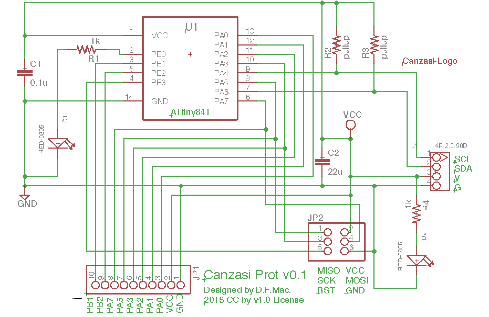
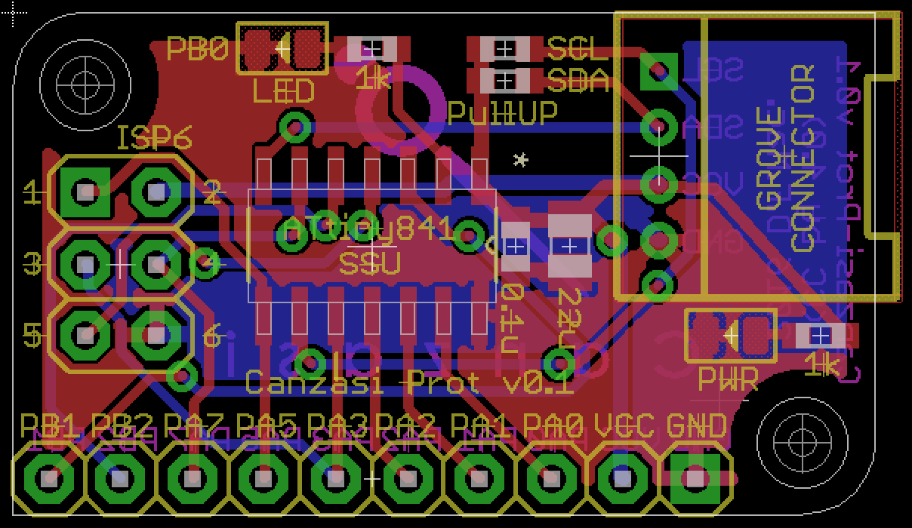

# Canzasi

「Canzasi」（かんざし）はArduinoを使ってI2C Slaveデバイスを試作するためのボードです。

## Consept

- Arduino IDE対応（ISP Programming）
- GROVEコネクタ
- ブレッドボードフレンドリー（1列GPIO）

# boards

## Canzasi-Prot (WIP)

ATtiny841を採用した「Canzasi」最初のプロトタイプボードです。
Arduino IDEからISP経由での書き込みに対応しています。

[eagle files (v0.1)](./boards/Prot/v0.1/eagle/)

# Licence

 このリポジトリで公開するプログラムソースコードやハードウエア設計情報は <a rel="license" href="http://creativecommons.org/licenses/by/4.0/">クリエイティブ・コモンズ 表示 4.0 国際 ライセンスの下に提供されています。</a>
