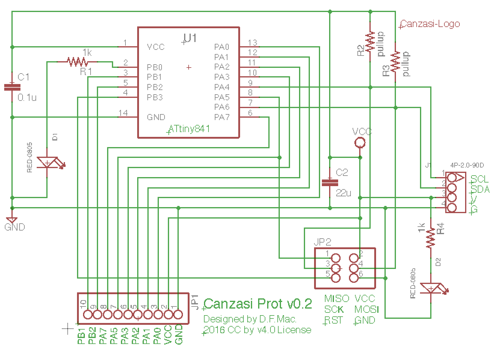
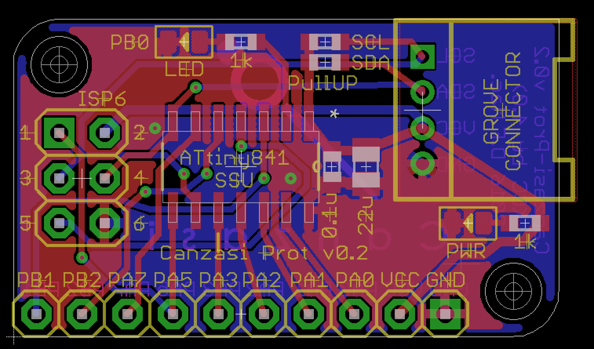
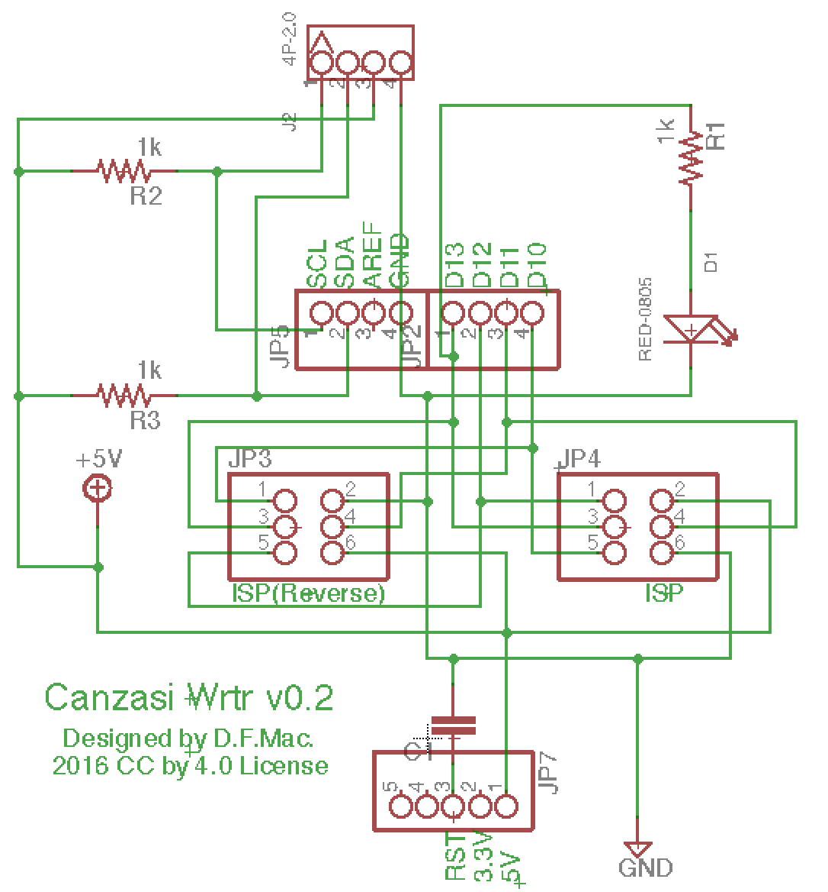
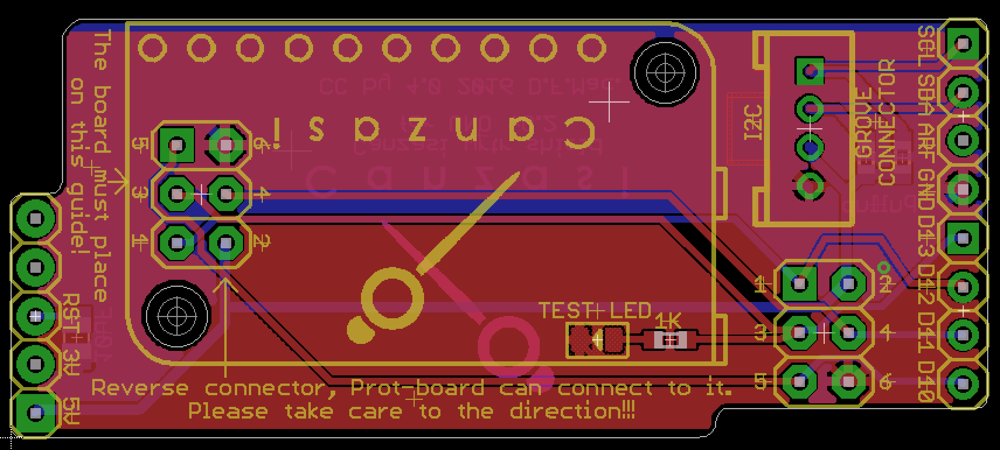

# Canzasi

「Canzasi」（かんざし）はArduinoを使ってI2C Slaveデバイスを試作するためのボードです。

# boards

## Canzasi-Prot

ATtiny841を採用した「Canzasi」最初のプロトタイプボードです。
Arduino IDEからISP経由での書き込みに対応しています。

### Concept

- Arduino IDE対応（ISP Programming）
- GROVEコネクタ
- ブレッドボードフレンドリー（1列GPIO）

### Design Data (v0.2)

[eagle files (v0.2)](./boards/Prot/v0.2/eagle/)

## Canzasi-Wrtr

Canzasi-Protにプログラムを書き込むためのArduino UNO用シールドです。

### Concept

- ミニマル
- Canzasi-Protとの接続にケーブル不要
- Groveコネクタ(I2C)付き。I2Cマスターのテストにも利用可能 (v0.2)

### Design Data (v0.2)

[eagle files (v0.2)](./boards/Wrtr/v0.2/eagle/)

# examples

## [blink](./examples/blink/Canzasi_blink/Canzasi_blink.ino)

Canzasi用のLチカです。
これは単なるLチカで、I2Cデバイスではありません。

## [simpleAnalogDevice](./examples/simpleAnalogDevice/Canzasi/Canzasi_I2CAnalogDevice/Canzasi_I2CAnalogDevice.ino)

Masterからのread要求を受けてADC (10bit)の値を返すサンプルです。    
simpleAnalogDeviceを利用するマスターデバイスのサンプルコードはこちら（[Arduino用](./examples/simpleAnalogDevice/Master/Arduino/I2C_MasterWordReader/I2C_MasterWordReader.ino)）です。

## [simpleButtonDevice](./examples/simpleButtonDevice/Canzasi/Canzasi_I2CDataProvider/Canzasi_I2CDataProvider.ino)

Masterからのread要求を受けてButtonが押されているかどうかを返すサンプルです。    
simpleButtonDeviceを利用するマスターデバイスのサンプルコードはこちら（[Arduino用](./examples/simpleButtonDevice/Master/Arduino/I2C_MasterReader/I2C_MasterReader.ino)）です。

## [simpleLedDevice](./examples/simpleLedDevice/Canzasi/Canzasi_I2Cblink/Canzasi_I2Cblink.ino)

Masterからのwriteデータを受けてLEDの点灯と消灯を行うサンプルです。    
simpleLedDeviceを利用するマスターデバイスのサンプルコードはこちら（[Arduino用](./examples/simpleLedDevice/Master/Arduino/I2C_MasterWriter/I2C_MasterWriter.ino)）です。

# Licence

 このリポジトリで公開するプログラムソースコードやハードウエア設計情報は <a rel="license" href="http://creativecommons.org/licenses/by/4.0/">クリエイティブ・コモンズ 表示 4.0 国際 ライセンスの下に提供されています。</a>
